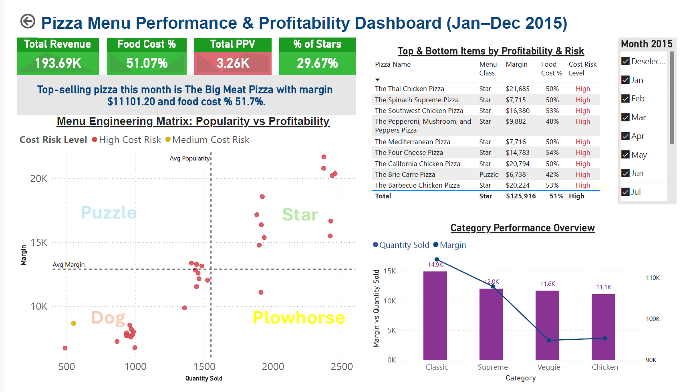

# F&B Menu Engineering and Performance Dashboard

## Executive Summary
Power BI dashboard optimizing **menu performance, profitability, and food cost efficiency** using **menu engineering principles**.  
Enables actionable decisions on **pricing, promotions, and menu optimization**.

---

## Dashboard Preview

*Power BI dashboard showing KPIs, menu engineering insights, cost risk, and category performance.*

---

## Project Overview
This project presents a **business intelligence dashboard** for Food & Beverage (F&B) operations, integrating **sales and cost analytics** with **menu engineering theory**.  
The dashboard empowers stakeholders to make **data-driven decisions** regarding pricing, promotions, menu composition, and profitability optimization.

---

## Business Problem
Restaurant operators often struggle to balance **menu popularity with profitability** while maintaining acceptable food cost levels.  
High-selling items may not be high-margin, and cost risks can remain hidden without structured analysis.  

This dashboard transforms raw sales and cost data into **clear, decision-ready insights**, highlighting both revenue opportunities and margin risks.

---

## Business Objectives
- Evaluate overall sales and profitability performance  
- Identify high- and low-performing menu items using menu engineering principles  
- Monitor food cost efficiency and margin risk  
- Support strategic decisions on pricing, promotions, and menu optimization  

---

## Key Features & Insights

### 📊 Executive KPI Overview
- **Total Revenue**  
- **Food Cost %**  
- **Total PPV (Profit per Volume)**  
- **% of Star Items**

These KPIs provide an at-a-glance view of overall business health and profitability.

---

### 📈 Menu Engineering Analysis
- **Scatter Plot (Menu Engineering Matrix)** mapping:  
  - Popularity (Quantity Sold)  
  - Profitability (Margin / PPV)  
- Classifies menu items into **Stars, Plowhorses, Puzzles, and Dogs** for targeted strategic decisions.

#### Methodology
Menu engineering analysis used **average unit sales** and **average margin** as benchmarks.  
Items were classified into **Stars, Puzzles, Plowhorses, and Dogs**, identifying opportunities for promotion, pricing adjustments, and cost control.

---

### 📋 Cost & Margin Risk Assessment
- Tabular view of:  
  - Cost Risk Level  
  - Margin  
  - Cost Percentage  
- Highlights menu items requiring pricing or cost interventions.

---

### 📊 Category-Level Performance Analysis
- **Bar Chart**: Quantity Sold by Category  
- **Line Chart**: Margin by Category  
- Enables comparison between volume-driven and margin-driven categories.

---

### 🧠 Dynamic Insight Card
- Automatically surfaces the **top-selling pizza for the selected month**  
- Displays item name, margin, and cost %  
- Provides instant actionable insight without manual analysis.

---

### 🗓 Interactive Time Analysis
- **Date slicer** supports trend analysis and month-over-month performance  
- Enables flexible evaluation across different time periods.

---

## Decision Support Use Cases
This dashboard enables stakeholders to:  
- Identify menu items to promote, reprice, or remove  
- Detect high-volume items with margin risk  
- Balance sales growth with profitability objectives  
- Monitor performance trends for operational planning

---

## Menu Engineering Action Framework

| Category | Business Actions |
|----------|----------------|
| Stars (High Popularity, High Profitability) | Promote and feature on menu; maintain quality; leverage in marketing |
| Puzzles (Low Popularity, High Profitability) | Improve visibility; bundle or reprice; train staff to upsell |
| Plowhorses (High Popularity, Low Profitability) | Control cost; slight price adjustment; optimize portion size |
| Dogs (Low Popularity, Low Profitability) | Remove, replace, or rework recipes; evaluate strategic fit |

---

## Results & Recommendations
- Promoting **Stars** increased potential revenue and maximized margin  
- **Puzzles and Plowhorses** were identified for repricing, bundling, or cost optimization  
- **Dogs** flagged for removal or recipe improvement to reduce margin risk  
- Insights guided actionable strategies for menu optimization and profitability improvement

---

## Next Steps
- Integrate historical data to identify trends  
- Add customer segmentation for targeted promotions  
- Implement predictive analytics for menu sales and margin  
- Automate dashboard refresh and alerts for cost/margin risks

---

## Tools & Technologies
- **Power BI** – Data modeling, DAX measures, dashboard development  
- **SQL** – Data extraction, transformation, and querying for analytics  
- **Excel / CSV** – Data preparation and validation  
- **Data Analytics & Visualization Best Practices**

---

## My Role
- Designed the **data model** and KPI framework  
- Developed **DAX measures** for revenue, cost %, margin, and PPV  
- Built **interactive, executive-focused visualizations**  
- Applied **menu engineering theory** to real-world sales data

---

## Key Achievements
- Designed **KPI framework** for revenue, margin, and PPV analysis  
- Applied **menu engineering methodology** to drive actionable insights  
- Built **interactive dashboards** for strategic decision-making

---

## Business Value
This project demonstrates the ability to:  
- Translate complex datasets into **clear business insights**  
- Apply analytical frameworks to **real operational decisions**  
- Build **executive-ready dashboards** for decision support  
- Communicate insights effectively to non-technical stakeholders

---

## Target Audience
- Restaurant Owners & Managers  
- Operations & Finance Teams  
- Business Intelligence & Data Analytics Professionals

---

## Author
**Jennifer Yik**  
Data Analytics | Business Intelligence | Dashboard Design  

📌 *This project is part of a professional analytics portfolio showcasing real-world, business-driven dashboard solutions.*

