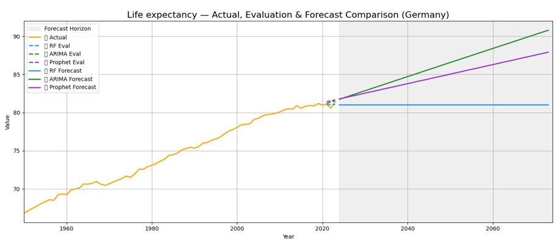

# Jennifer Yik – Data Analytics & BI Portfolio

Welcome to my portfolio! I showcase real-world projects that demonstrate my ability to transform complex data into actionable insights. Through **Power BI**, **SQL**, and **data analysis techniques**, I solve business challenges and provide data-driven solutions in **Business Intelligence (BI)** and **Dashboard Development**.

## Projects

1. **[F&B Menu Engineering & Performance Dashboard](./01_F&B_Menu_Engineering_and_Performance_Dashboard)**  
  Developed an interactive **Power BI dashboard** to analyze **menu performance**, **profitability**, and **cost efficiency** in a Food & Beverage (F&B) setting. The dashboard applies **menu engineering principles** to classify menu items, uncover margin risks, and optimize decision-making for pricing, promotions, and menu composition, resulting in improved **profitability** and **operational efficiency**.

2. **[Capstone Project – Big Data Analytics](./02_Capstone_Project)**  
  Applied **Python**, **ARIMA**, **Prophet**, and **Random Forest** models to **forecast global health and economic trends** (1950–2023). By analyzing large-scale historical data, I predicted disease trends and their future impacts, enabling **strategic planning** and **resource allocation** through 2074.

## Project Previews

  
*Snapshot of my F&B Menu Engineering dashboard, providing key insights into **KPIs**, **menu optimization**, and **cost analysis** to drive **data-driven decisions** for F&B businesses.*

---

  
*Snapshot of my Big Data Analytics capstone project, forecasting long-term global health and economic trends using large-scale historical data to support strategic, long-term decision-making.*

---

## Connect

I'm passionate about using data to solve business problems. Feel free to connect with me to discuss analytics, BI, and how I can contribute to your team!

[LinkedIn](https://www.linkedin.com/in/jenniferyik/) | [GitHub](https://github.com/jenniferyik/Portfolio)

---

### Tools & Technologies Used
- **Power BI** – Designed interactive dashboards, created custom DAX measures, and implemented **data modeling** techniques to provide business users with real-time insights.
- **SQL** – Data extraction, transformation, and reporting for BI dashboards.
- **Python** – Data analysis, forecasting, and machine learning models.
- **Excel** – Advanced data manipulation and reporting.

